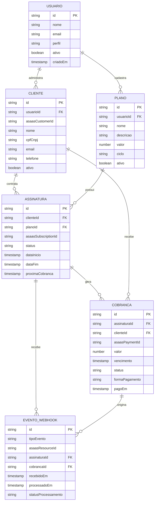
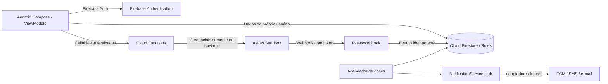
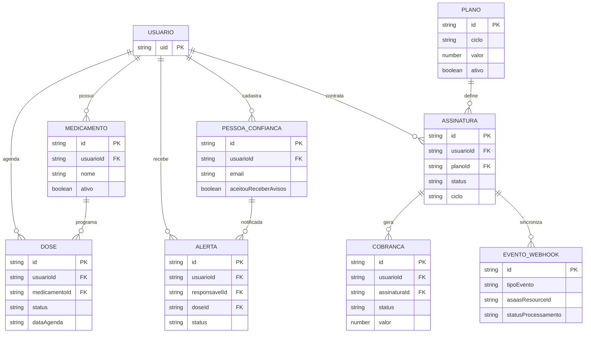

# TomaAi

# Aplicativo de Gerenciamento de Assinaturas

## 1. Descrição do Projeto

O projeto consiste no desenvolvimento de um aplicativo Android para gerenciamento de clientes, planos, assinaturas e cobranças recorrentes.

A aplicação será desenvolvida utilizando Kotlin e Jetpack Compose, com Firebase como plataforma de autenticação, armazenamento e backend serverless. A integração com pagamentos será realizada por meio da API externa do Asaas.

O objetivo é oferecer uma interface para acompanhar os clientes e o ciclo de vida das assinaturas, mantendo os dados financeiros sincronizados com os eventos recebidos da plataforma de pagamentos.

## 2. Stack Tecnológica

| Tecnologia               | Finalidade                  |
| ------------------------ | --------------------------- |
| Kotlin                   | Desenvolvimento Android     |
| Jetpack Compose          | Interface de usuário        |
| MVVM                     | Organização arquitetural    |
| Firebase Authentication  | Autenticação                |
| Cloud Firestore          | Banco de dados              |
| Firebase Cloud Functions | Backend seguro              |
| Asaas API                | Pagamentos e assinaturas    |
| Webhooks Asaas           | Sincronização de eventos    |
| Firebase Cloud Messaging | Notificações, se necessário |

## 3. Arquitetura

O projeto utiliza uma arquitetura cliente-servidor com organização em camadas e backend serverless.

O aplicativo Android não acessa diretamente a API do Asaas. As operações financeiras são encaminhadas para o Firebase Cloud Functions, que executa as chamadas externas em ambiente de backend.

### Camadas

* Apresentação: Jetpack Compose.
* Estado: ViewModel e UiState.
* Dados: Repository.
* Backend: Firebase Cloud Functions.
* Persistência: Cloud Firestore.
* Integração externa: Asaas API.

## 4. Segurança

A chave privada da API do Asaas não deve ser armazenada no aplicativo Android.

As chamadas à API de pagamentos devem ser realizadas pelo backend. Os webhooks devem validar o token de autenticação configurado e utilizar o identificador do evento para evitar processamento duplicado.

## 5. Modelo de Dados

O banco de dados será implementado utilizando Cloud Firestore. O modelo lógico é representado por entidades relacionadas por identificadores.

Entidades principais:

* Usuario
* Cliente
* Plano
* Assinatura
* Cobranca
* EventoWebhook

## 6. Diagrama Entidade-Relacionamento



## 7. Fluxo de Pagamento

1. O usuário realiza login.
2. O usuário seleciona um cliente.
3. O usuário escolhe um plano.
4. O aplicativo envia uma solicitação para uma Cloud Function.
5. A Cloud Function realiza a integração com o Asaas.
6. O Asaas cria a assinatura ou cobrança.
7. O Asaas envia eventos para o webhook.
8. A Cloud Function processa o evento.
9. O Firestore é atualizado.
10. O aplicativo exibe o status atualizado.

## 9. Configuração local e Asaas Sandbox

### Android

1. Configure o projeto Firebase Android e mantenha `google-services.json` em `app/`.
2. Ative Firebase Authentication (provedor e-mail/senha) e Cloud Firestore.
3. Execute `./gradlew assembleDebug` no macOS/Linux ou `gradlew.bat assembleDebug` no Windows.

### Cloud Functions

Requer Node.js 20. Instale dependências e compile:

```bash
cd functions
npm ci
npm run build
```

Copie `functions/.env.example` para `functions/.env` e preencha `ASAAS_URL=https://sandbox.asaas.com/api/v3`, `ASAAS_API_KEY`, `ASAAS_WEBHOOK_TOKEN`, `PRECO_QUINZENAL` e `PRECO_MENSAL`. O `.env` local está ignorado pelo Git. Os dois preços são obrigatórios e devem ser definidos pelo responsável pelo produto; não há valores padrão embutidos. `listarPlanos` cria os documentos `planos/QUINZENAL` e `planos/MENSAL` na primeira leitura autenticada. O app nunca recebe nem envia a chave privada do Asaas. Para produção, configure os valores por Secret Manager/variáveis do ambiente e use a URL oficial de produção.

Configure no painel Asaas Sandbox o webhook para a URL HTTPS da Function `asaasWebhook` e use o mesmo segredo configurado em `ASAAS_WEBHOOK_TOKEN`. O endpoint rejeita requisições se o segredo não estiver configurado ou não corresponder ao cabeçalho `asaas-access-token`.

```bash
firebase emulators:start --only auth,firestore,functions
```

Selecione o projeto Firebase antes de publicar:

```bash
firebase use --add <firebase-project-id>
firebase deploy --only firestore,functions
```

O agendador `verificarDosesNaoConfirmadas` é executado a cada 15 minutos. Ele cria um documento idempotente em `alertas` após 30 minutos de atraso e só considera o responsável padrão com `aceitouReceberAvisos == true`. O adaptador de notificações atual é um stub de desenvolvimento; conectar FCM, SMS ou e-mail requer uma implementação de `NotificationService` e a configuração correspondente. As cobranças quinzenais são avulsas no Asaas e geradas pelo agendador diário a cada 15 dias depois da confirmação da cobrança anterior; o ciclo mensal usa a assinatura recorrente nativa do Asaas.

Os agendadores precisam do serviço Cloud Scheduler habilitado no projeto Firebase/Google Cloud.

## 10. Arquitetura dos módulos



### DER das coleções atuais



## 11. Considerações

A integração deverá ser desenvolvida inicialmente em ambiente Sandbox. Antes da utilização em produção, deverão ser realizados testes de autenticação, criação de clientes, criação de assinaturas, processamento de cobranças, cancelamentos, eventos duplicados e falhas de comunicação.
